# 基于VirtualBox的网络攻防基础环境搭建

## 实验环境

- Host Machine

  - Windows 11 22H2 build 22622.590

- Virtual Machine Platform

  - VirtualBox 6.1.38 r153438

- Guest Machine

  - Attacker:
  
    - attacker-kali: Kali 2022.3 kali-rolling

  - Gateway:
  
    - gateway-debian: Debian 10 buster

  - Victim:

    - victim-kali: Kali 2022.3 kali-rolling

    - victim-xp-1: Windows xp 5.1 build 2600.xpsp.080413-2111:ServicePack3

    - victim-debian: Debian 10 buster

    - victim-xp-2: Windows xp 5.1 build 2600.xpsp.080413-2111:ServicePack3

## 实验要求

- [x] 虚拟硬盘配置成多重加载，效果如下图所示：

  

- [x] 搭建满足如下拓扑图所示的虚拟机网络拓扑

  

- 完成以下网络连通性测试：

  - [x] 靶机可以直接访问攻击者主机

  - [x] 攻击者主机无法直接访问靶机

  - [x] 网关可以直接访问攻击者主机和靶机

  - [x] 靶机的所有对外上下行流量必须经过网关

  - [x] 所有节点均可以访问互联网

## 实验过程记录

### Guest Machine Configuration

#### Multiattach Set Up

首先从来没有听说过`多重加载`这个名词，真白玩了那么久虚拟机，由于不确定翻译于是用直接咕咕噜中文`virtualbox 多重加载`，然后通过某个搜索结果进入的博客转载网站找到了CSDN的原文😓，了解了一下操作流程，大致分为以下两步：

1. 在VirtualBox菜单栏中的`管理`>`虚拟介质管理`中找到目标介质

2. 选中目标介质，如果介质已被分配则需要先点击`释放`，此时会提醒将介质从添加到的虚拟机移除，确认后再点击`属性`切换出窗口下方的属性页面，在`类型`选单内选择多重加载后在右下角点击应用即可；如果没有被分配则直接可以在属性页面内直接选择类型并应用

如是进行操作之后很轻松地将攻击者主机、网关和4台靶机的磁盘配置了多重加载，效果如下图所示：

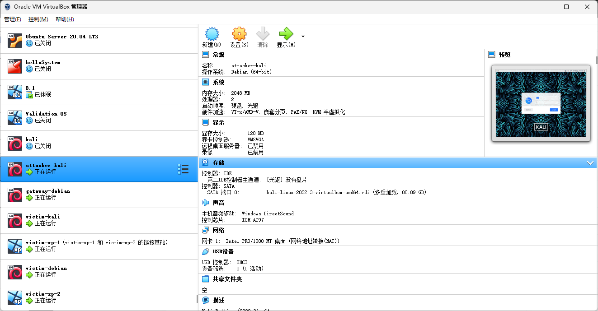

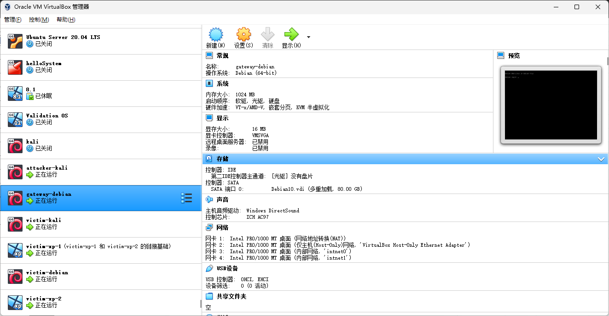

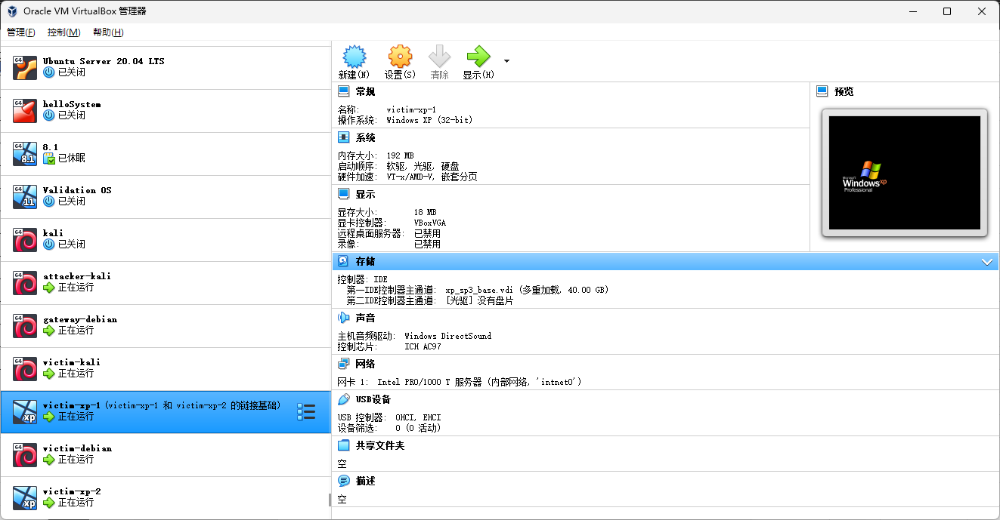

显然我们有6台虚拟机但只放了3张截图，主要是考虑到多重加载的特性，CSDN的那篇文章说实话我没看太懂，但大概理解到多重加载的意思就是

>可以使此类型的磁盘介质拥有“在某个时间点上，被新建的相同系统的虚拟机直接使用，便可复制出这个时间点上的旧的相同系统的虚拟机”的能力

说白了有点像树，多重加载的磁盘介质每被新建的虚拟机直接引用就会多一个当前时间点的子节点🤔

所以剩余的相同系统均是由同一磁盘介质复制出来的，自然也不需要那么多截图（自信）

讲道理万一错了就很尴尬😂，所以为了保险起见我专门去查了VirtualBox的文档，而里面的解释通俗易懂，恰好是我理解的意思，原文是这样说的：

>Multiattach mode images can be attached to more than one virtual machine at the same time, even if these machines are running simultaneously. For each virtual machine to which such an image is attached, a differencing image is created. As a result, data that is written to such a virtual disk by one machine is not seen by the other machines to which the image is attached. Each machine creates its own write history of the multiattach image.

就不翻译了，总之我理解的没错，同时再吐槽一下CSDN上的文章真的一言难尽

#### 虚拟机网络拓扑搭建

这里其实不太难理解，在完成上一步的内容时已经就顺手把网卡给分配了，还是按图说话：


首先图片里面有两个`内部网络`，里面分别有两台系统不一样的靶机，我没有擅自修改太多，直接照着图进行摆放，感觉有点像用复杂化的Packet Tracer，只能通过手动设置网卡来划分子网的那种🤔

图上左侧黄色部分的`Internal Network 1`我在VirtualBox网卡配置时给的名称为`intnet0`，右上侧灰色的`Internal Network 2`则是被我配置为`intnet1`，两个内部网络中的靶机分别仅配置一张`内部网络`连接方式的网卡，网络名称分别设置为对应内网的名称，于是两个内网首先设置完毕

然后是网关部分，上课时快速记忆下来了网关所需的4张网卡的配置方式，这里直接配置：

- 网卡1：NAT连接方式，用于连接外网

- 网卡2：Host-Only网络，用于宿主机SSH连接

- 网卡3：内部网络`intnet0`，用于路由`Internal Network 1`

- 网卡4：内部网络`intnet1`，用于路由`Internal Network 2`

最后是攻击者主机部分，这个显然是只连接了外网所以只需要配置一张NAT方式的网卡即可

这里其实有一点`散装黑盒`的意思：由于直接导入使用了老师提供的磁盘介质，整个系统的安装与配置过程并不是由我完成，在完成这部分配置的过程中我所出的力仅在于`新建虚拟机`+`按需设置网卡`，而关于网关设备`gateway-debian`系统内最初的网卡硬件固定IP地址分配与两个内网对于外网攻击者`attacker-kali`的屏蔽分流两部分内容则是没有在意，磁盘介质完全是被当作黑盒直接拿来使用了😂

配置完成之后这里分别放上6台虚拟机的系统内IP配置，应该就足以说明网络的配置情况了：

Virtual Machine|IP Configuration Screenshot
:-:|:-:
attacker-kali|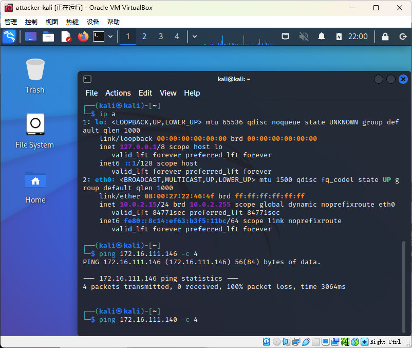
gateway-debian|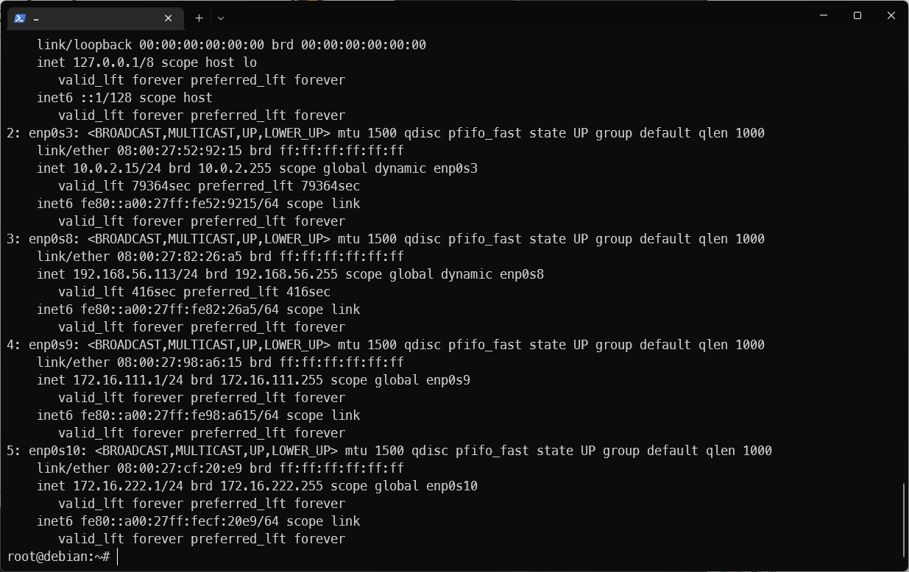
victim-kali|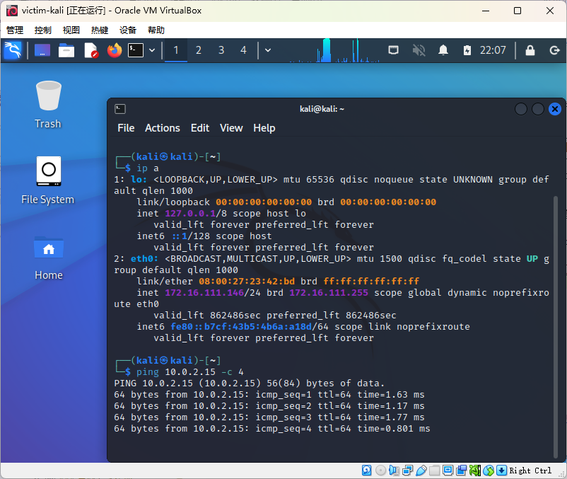
victim-xp-1|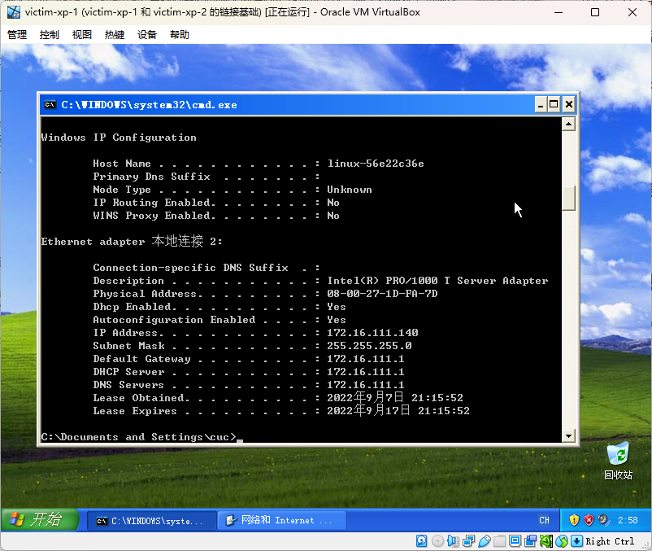
victim-debian|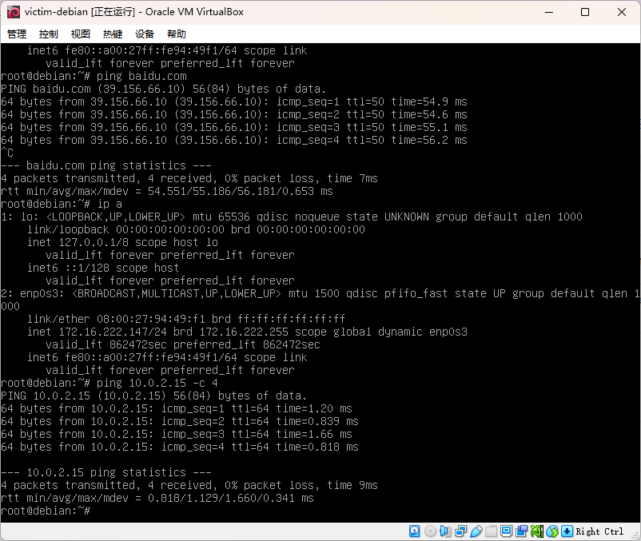
victim-xp-2|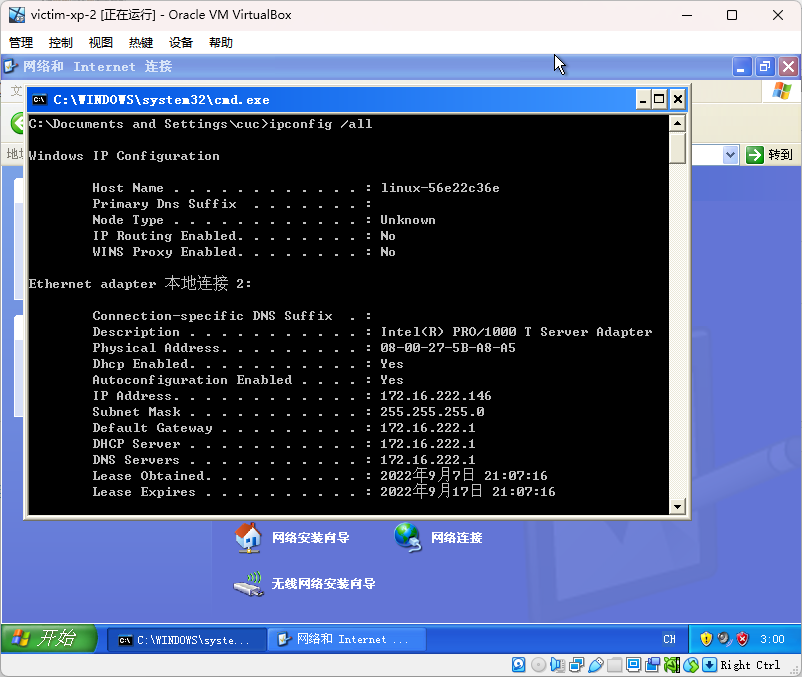

### 网络连通性目标要求实现

众所周知：

>连通性=能`ping`通

所以以下的连通性相关目标测试均通过这条古老但是有效的命令实现

#### 靶机可以直接访问攻击者主机

翻译一下，需要4台靶机能ping通攻击者主机`attacker-kali`

首先从上一步的操作中得知`attacker-kali`的IP地址是`10.0.2.15`，由于Windows系统默认只执行4次ping包发送，于是计划在4台靶中的Linux机器中执行ping命令时也添加`-c 4`来限制ping次数

~~(电脑死机了，到这里是之前写的内容，好多证明用的虚拟机状态无了，晚点再继续写)~~

再次打开VirtualBox，两台靶机XP直接废了，载入点错误🤯

显然不像是能手动修复的错误，于是直接删掉新建了

~~其实这里还死机了一次，排查了一下可能是Windows的休眠机制导致的问题，总之进行了一番处理，希望不要再有事了~~

言归正传，目标是在4台靶机上分别执行`ping 10.0.2.15 -c 4`，但是在重新调试虚拟机后发现，用了NAT网卡的`attacker-kali`和`gateway-debian`两台机器的IPv4地址均为`10.0.2.15`，不出意外是通过同一IP的不同端口实现了网络连接，思考了一下感觉上面的方法是有问题的，但是又发现由于IPv6的特性，两台机器的IPv6地址是不同的，于是转念尝试通过ping`attacker-kali`的IPv6地址来测试连通性

再一次首先，通过`ip a`命令得知了`attacker-kali`的IPv6地址为`fe80::8c14:ef63:b3f5:11bc`，其次是对2台XP靶机启用IPv6，通过`控制面板`>`网络连接`找到`本地连接`右键点击`属性`，在`常规`页面下点击`安装`，在弹出窗口上方选框内点击`协议`然后点击`添加`按钮，在新的弹出窗口中选择第一项`Microsoft TCP/IP 版本6`然后点击`确定`按钮，随后点击`关闭`按钮退出本地连接的属性窗口，回到`cmd`再次使用`ipconfig /all`发现本地连接已经有了IPv6地址了

“于是便可以在4台靶机上通过Pv6地址确认连通性了”，原本是打算这么说的，但是发现导入的`gateway-debian`里面就没有配置`ip6tables`，属于是我自找麻烦了，直接ping那个重复的IPv4地址吧，我放弃了(其实是我懒得去配`ip6tables`，至少写报告这会儿不想搞)

以下为靶机ping攻击者的结果截图：

Victim|Screenshot
:-:|:-:
victim-kali|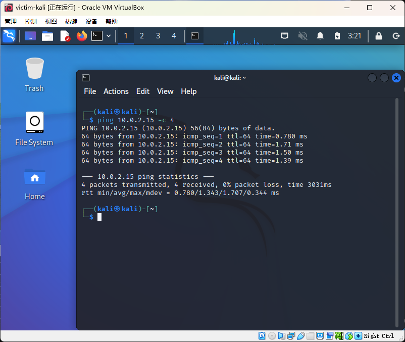
victim-xp-1|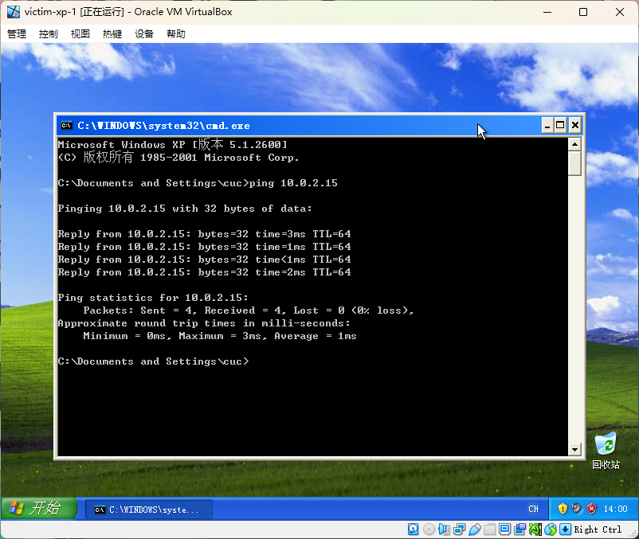
victim-debian|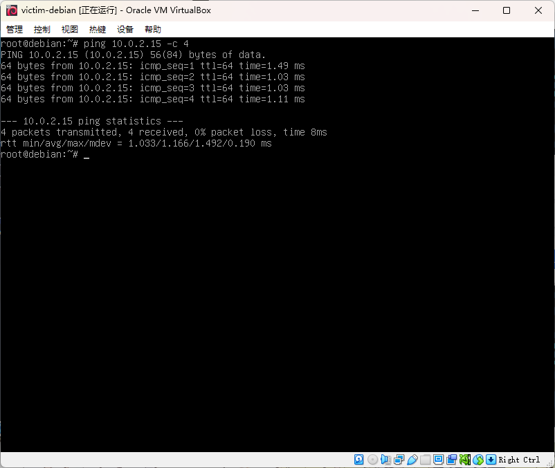
victim-xp-2|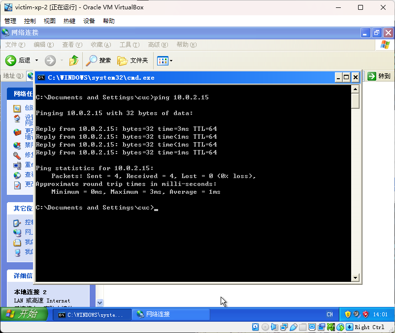

>2022/9/19 Update  
>挺早就看完了实验的讲解视频，也很早在PR里面追加了要修改这部分内容的评论，正式修改终于还是拖到了DDL😶

需要修正的部分是有关`attacker-kali`和`gateway-debian`两台机器的外网网卡配置，这里用追加的形式继续进行记录

前文的内容可以说明，我自己捣鼓的配置是完全踩坑到NAT网卡上，这里放上VirtualBox官网文档对网卡功能性的描述，非常直观：

>Table 6.1. Overview of Networking Modes  
>Mode|VM→Host|VM←Host|VM1↔VM2|VM→Net/LAN|VM←Net/LAN
>:-:|:-:|:-:|:-:|:-:|:-:
>Host-only|+|+|+|-|-
>Internal|-|-|+|-|-
>Bridged|+|+|+|+|+
>NAT|+|[Port forward](https://www.virtualbox.org/manual/ch06.html#natforward)|-|+|[Port forward](https://www.virtualbox.org/manual/ch06.html#natforward)
>NATservice|+|[Port forward](https://www.virtualbox.org/manual/ch06.html#natforward)|+|+|[Port forward](https://www.virtualbox.org/manual/ch06.html#natforward)

当然视频里面也有讲到，NAT相当于每台虚拟机连接到不同的交换机上，而NAT网络则是可以通过配置不同的NAT网络标识来实现多台虚拟机连接到同一台交换机上，于是这次修正的具体操作是在VirtualBox的`管理`>`全局设置`>`网络`内新建一个NAT网络`NatNetwork1`，分配网段为`10.0.3.0/24`，而原有的`NatNetwork`则不改变原分配的网段`10.0.2.0/24`，但是要改名为`NatNetwork0`(一些强迫症的道理😂)，具体配置可以看下面的截图：

NAT Network|Configuration Screenshot
:-:|:-:
NatNetwork0|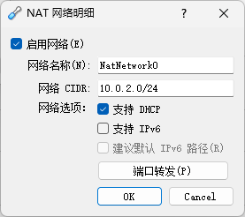
NatNetwork1|

然后是修改`attacker-kali`仅有的一块的网卡为`NAT网络，'NatNetwork1'`，而`gateway-debian`则是将原本的NAT网卡改为`NAT网络，'NatNetwork0'`，其他配置不变，目标仍然是让`attacker-kali`能够被4台靶机访问到，操作也仍然是4台靶机分别ping`attacker-kali`的IP...

很显然到这里我才发现前面的理解出了大问题，之所以能发现也是因为按照上面的思路配置之后发现两个NAT网络的虚拟机并不能互相ping通，大概查了一些关于不同NAT网络之间连通性的内容后发现还是回到上面的`Table 6.1. Overview of Networking Modes`，也就是需要端口转发来实现，所以我又重新看了一下实验讲解的视频，发现其实是配置在同一个NAT网络上就行了，所以上面设置好的两个NAT网络就留一个吃灰吧，现在只需要给`attacker-kali`和`gateway-debian`分配到同一个NAT网络就行，重启虚拟机后发现一切正常，关于两台使用NAT网络的虚拟机的IP，`attacker-kali`仍然是之前的`10.0.2.15`，`gateway-debian`则变成了`10.0.2.4`

以下是新的连通性测试截图：

Victim|Screenshot
:-:|:-:
victim-kali|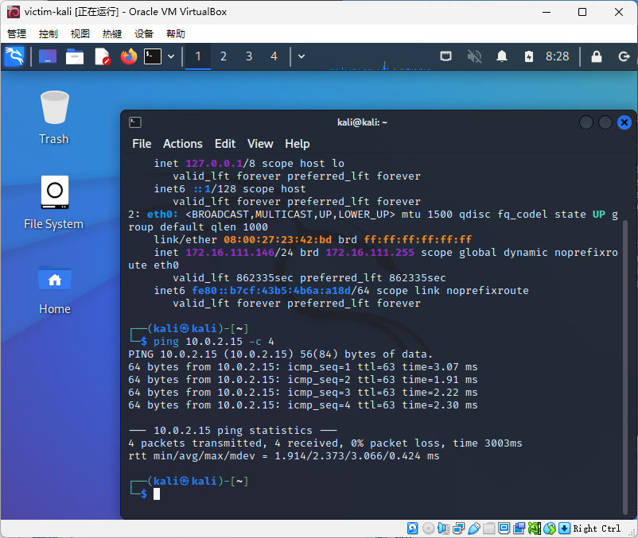
victim-xp-1|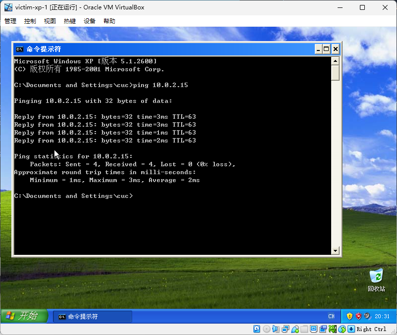
victim-debian|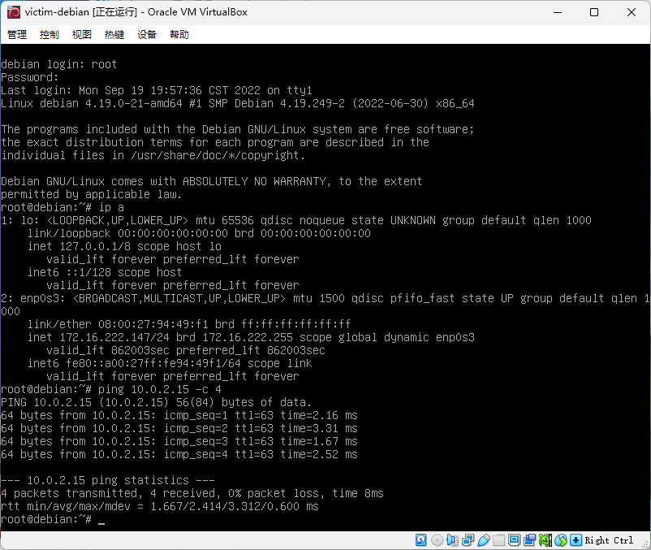
victim-xp-2|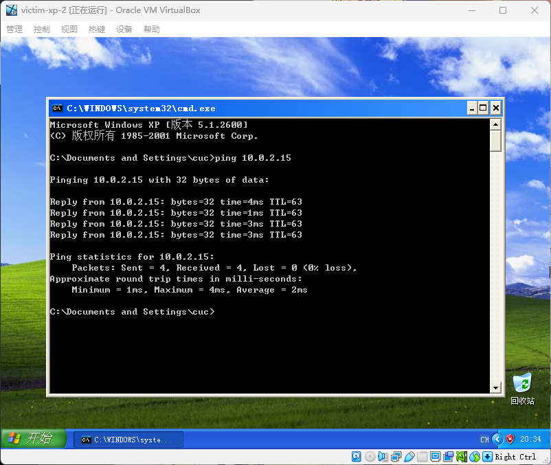

#### 攻击者主机无法直接访问靶机

思路上很好理解，从`attacker-kali`无法ping通4台靶机，操作上则是分别在4台靶机上获取外网IP，随后在`attacker-kali`上发送ping包，仍然是使用`-c 4`来限制ping次数为4次，以下为结果截图：

Victim|Target IP|Screenshot
:-:|:-:|:-:
victim-kali|172.16.111.146|
victim-xp-1|172.16.111.102|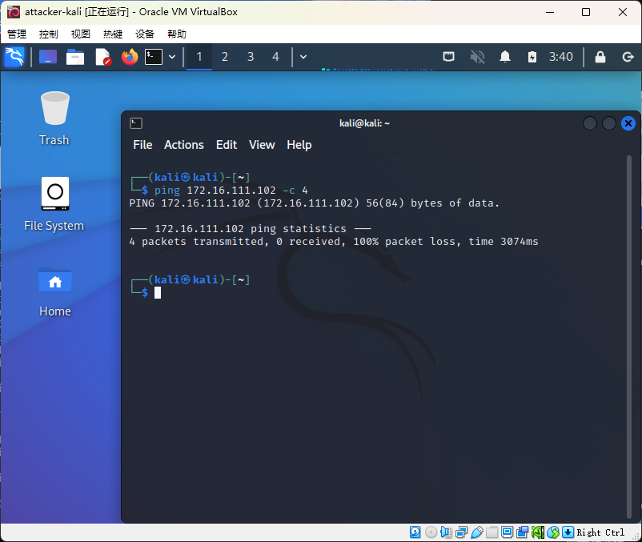
victim-debian|172.16.222.147|
victim-xp-2|172.16.222.114|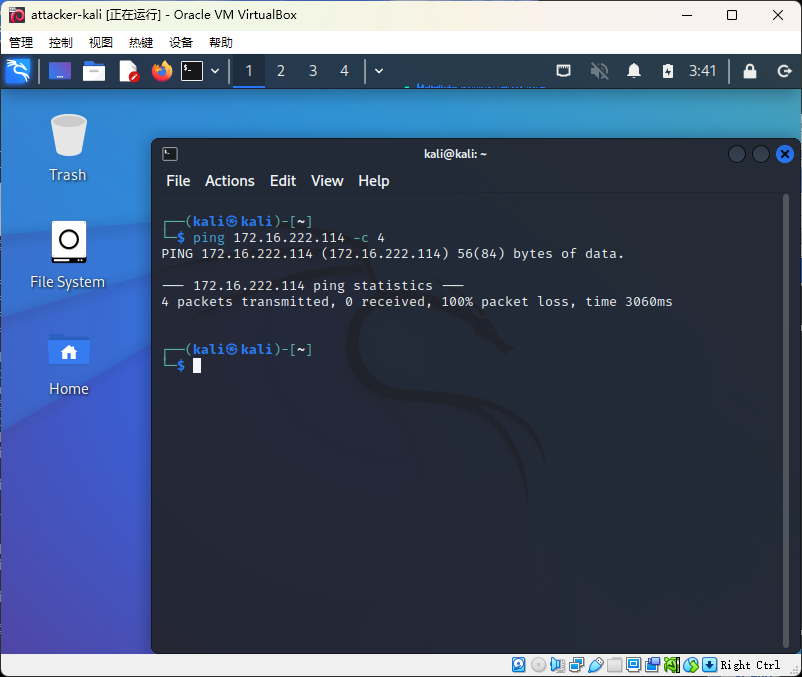

#### 网关可以直接访问攻击者主机和靶机

思路：在`gateway-debian`上向`attacker-kali`以及4台靶机分别发送ping包并能正常接收

这里有一个小坑的，之前操作的时候发现，只有两台XP的靶机不能被`gateway-debian`ping通，第一个想到的就是防火墙问题，到这里完全是使用经验支撑我尝试在`控制面板`>`网络和Internet连接`>`Windows防火墙`>`高级`>`ICMP设置`里面启用`允许传入路由器请求`，随后发现仍然不能ping通，于是又尝试同时打开了`允许传入回显请求`，此时就可以ping通了，同时为了确认上面启用的两个选项到底哪个是真正允许ping通的选项，我又尝试通过控制变量：关掉了`允许传入路由器请求`而只保留`允许传入回显请求`，然后再次尝试从`gateway-debian`发送ping包，发现仍然可以ping通，于是确信只需要启用后者即可

这里完全就是当时的我不仔细看，在`ICMP设置`窗口，如果此时光标停留在`允许传入回显请求`上，选择框下方的`描述`其实就有清楚地说清楚所选项目的功能，以下就是描述原文：

>送到这个计算机的消息将被重复发送给发件人。这常用于疑难解答--例如，ping计算机。如果启用了TCP端口446，此类请求被自动允许。

所以说还是要有耐心以及要细心😂

以下是操作结果截图：

Target|Target IP|Screenshot
:-:|:-:|:-:
attacker-kali|10.0.2.15|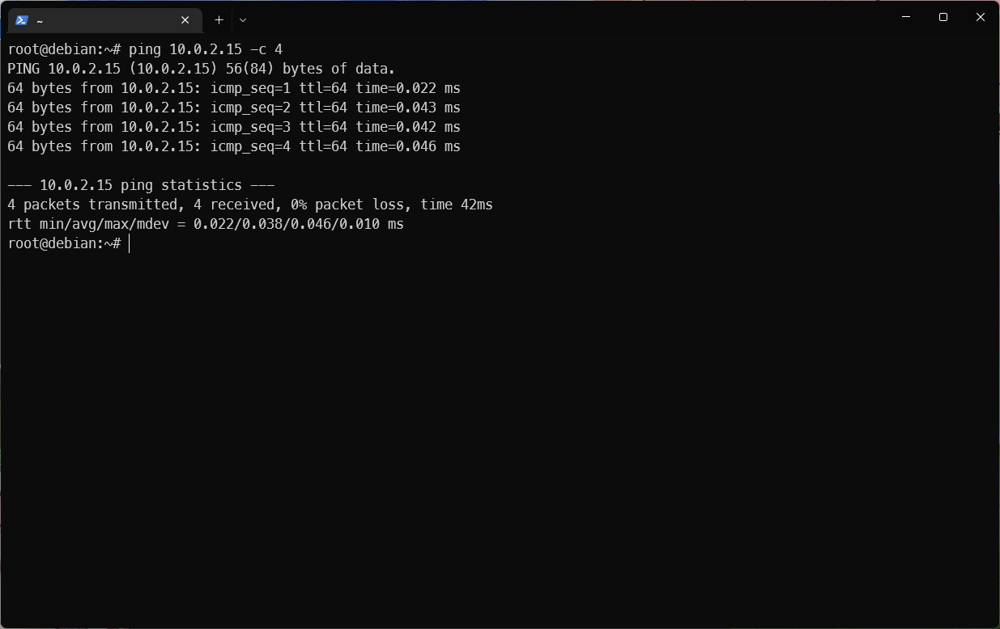
victim-kali|172.16.111.146|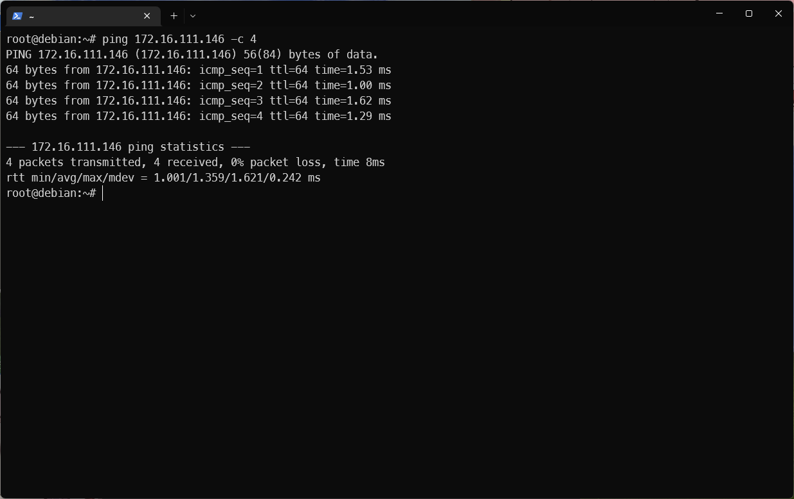
victim-xp-1|172.16.111.102|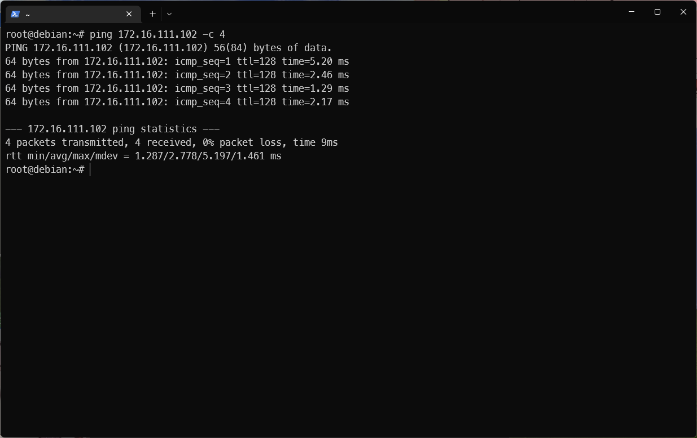
victim-debian|172.16.222.147|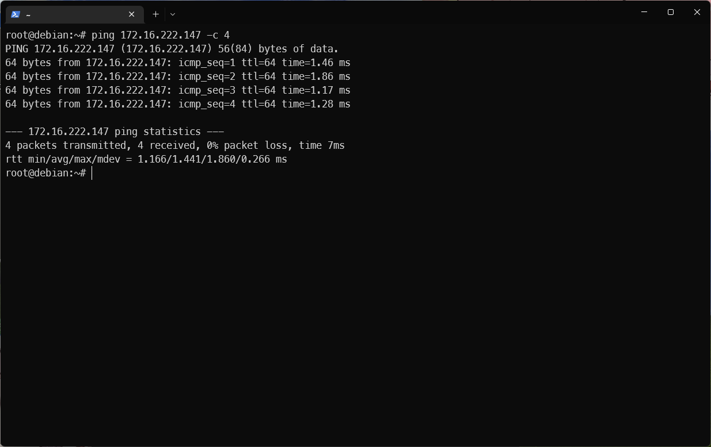
victim-xp-2|172.16.222.114|

#### 靶机的所有对外上下行流量必须经过网关

做实验那会儿还记得上课说的，可以通过`tcpdump`来完成`gateway-debian`上网卡3、网卡4的流量抓包，也就是分别对应`intnet0`和`intnet1`的路由抓包来证明流量确实经过网关，于是直接查了一下`tcpdump`的基本用法，并使用shell的重定向输出`>>`将抓到的包保存到本地的两个txt文件内方便直接明文查看，然后为了方便向`gateway-debian`安装了增强件后添加了宿主机的共享文件夹自动挂载，于是可以非常轻松地获得两个内网抓包的记录，下面直接放上文件内容：

- intnet0.txt

  ```plaintext
  #我知道这个不是注释的写法但是还是想这么写😂
  #这里是intnet0网络的抓包记录
  #由于是早期完成的抓包所以IP地址可能和后面重新配置靶机之后的IP地址不一样
  #为了区分intnet0内的2台靶机，我让其中一台ping百度(baidu.com)，一台ping京东(jd.com)
  #可以很清晰地看到DNS解析与ICMP的请求和返回记录
  21:26:20.117207 IP 172.16.111.146.43796 > 172.16.111.1.domain: 16147+ A? baidu.com. (27)
  21:26:20.117232 IP 172.16.111.146.43796 > 172.16.111.1.domain: 36369+ AAAA? baidu.com. (27)
  21:26:20.121877 IP 172.16.111.1.domain > 172.16.111.146.43796: 16147* 2/0/1 A 110.242.68.66, A 39.156.66.10 (468)
  21:26:20.122206 IP 172.16.111.1.domain > 172.16.111.146.43796: 36369* 0/0/0 (27)
  21:26:20.126276 IP 172.16.111.146 > 110.242.68.66: ICMP echo request, id 33068, seq 1, length 64
  21:26:20.207219 IP 110.242.68.66 > 172.16.111.146: ICMP echo reply, id 33068, seq 1, length 64
  21:26:20.208281 IP 172.16.111.146.42128 > 172.16.111.1.domain: 50845+ PTR? 66.68.242.110.in-addr.arpa. (44)
  21:26:20.208526 IP 172.16.111.1.domain > 172.16.111.146.42128: 50845 NXDomain 0/0/0 (44)
  21:26:21.127262 IP 172.16.111.146 > 110.242.68.66: ICMP echo request, id 33068, seq 2, length 64
  21:26:21.209156 IP 110.242.68.66 > 172.16.111.146: ICMP echo reply, id 33068, seq 2, length 64
  21:26:21.210638 IP 172.16.111.146.44079 > 172.16.111.1.domain: 51957+ PTR? 66.68.242.110.in-addr.arpa. (44)
  21:26:21.210951 IP 172.16.111.1.domain > 172.16.111.146.44079: 51957 NXDomain 0/0/0 (44)
  21:26:22.127570 IP 172.16.111.146 > 110.242.68.66: ICMP echo request, id 33068, seq 3, length 64
  21:26:22.206884 IP 110.242.68.66 > 172.16.111.146: ICMP echo reply, id 33068, seq 3, length 64
  21:26:22.207934 IP 172.16.111.146.42263 > 172.16.111.1.domain: 20100+ PTR? 66.68.242.110.in-addr.arpa. (44)
  21:26:22.208240 IP 172.16.111.1.domain > 172.16.111.146.42263: 20100 NXDomain 0/0/0 (44)
  21:26:23.128345 IP 172.16.111.146 > 110.242.68.66: ICMP echo request, id 33068, seq 4, length 64
  21:26:23.213621 IP 110.242.68.66 > 172.16.111.146: ICMP echo reply, id 33068, seq 4, length 64
  21:26:23.214949 IP 172.16.111.146.43618 > 172.16.111.1.domain: 19141+ PTR? 66.68.242.110.in-addr.arpa. (44)
  21:26:23.215247 IP 172.16.111.1.domain > 172.16.111.146.43618: 19141 NXDomain 0/0/0 (44)
  21:26:25.282001 ARP, Request who-has 172.16.111.146 tell 172.16.111.1, length 28
  21:26:25.283978 ARP, Reply 172.16.111.146 is-at 08:00:27:23:42:bd (oui Unknown), length 46
  21:26:25.303471 ARP, Request who-has 172.16.111.1 tell 172.16.111.146, length 46
  21:26:25.303483 ARP, Reply 172.16.111.1 is-at 08:00:27:98:a6:15 (oui Unknown), length 28
  21:26:25.610008 ARP, Request who-has 172.16.111.1 tell 172.16.111.140, length 46
  21:26:25.610020 ARP, Reply 172.16.111.1 is-at 08:00:27:98:a6:15 (oui Unknown), length 28
  21:26:25.611091 IP 172.16.111.140.1030 > 172.16.111.1.domain: 56938+ A? jd.com. (24)
  21:26:25.615184 IP 172.16.111.1.domain > 172.16.111.140.1030: 56938* 4/0/1 A 211.144.27.126, A 211.144.24.218, A 111.13.149.108, A 106.39.171.134 (468)
  21:26:25.618838 IP 172.16.111.140 > 211.144.27.126: ICMP echo request, id 512, seq 7936, length 40
  21:26:25.721489 IP 211.144.27.126 > 172.16.111.140: ICMP echo reply, id 512, seq 7936, length 40
  21:26:26.618161 IP 172.16.111.140 > 211.144.27.126: ICMP echo request, id 512, seq 8192, length 40
  21:26:26.722469 IP 211.144.27.126 > 172.16.111.140: ICMP echo reply, id 512, seq 8192, length 40
  21:26:27.619195 IP 172.16.111.140 > 211.144.27.126: ICMP echo request, id 512, seq 8448, length 40
  21:26:27.721270 IP 211.144.27.126 > 172.16.111.140: ICMP echo reply, id 512, seq 8448, length 40
  21:26:28.620290 IP 172.16.111.140 > 211.144.27.126: ICMP echo request, id 512, seq 8704, length 40
  21:26:28.725915 IP 211.144.27.126 > 172.16.111.140: ICMP echo reply, id 512, seq 8704, length 40
  ```

- intnet1.txt

  ```plaintext
  #这里是intnet1网络的抓包记录
  #同上仍然是一台靶机ping百度，一台靶机ping京东
  21:27:26.275739 IP 172.16.222.147.44220 > 172.16.222.1.domain: 4020+ A? baidu.com. (27)
  21:27:26.276414 IP 172.16.222.1.domain > 172.16.222.147.44220: 4020 2/0/0 A 39.156.66.10, A 110.242.68.66 (59)
  21:27:26.276502 IP 172.16.222.147.44220 > 172.16.222.1.domain: 33210+ AAAA? baidu.com. (27)
  21:27:26.281054 IP 172.16.222.1.domain > 172.16.222.147.44220: 33210* 0/0/0 (27)
  21:27:26.284579 IP 172.16.222.147 > 39.156.66.10: ICMP echo request, id 603, seq 1, length 64
  21:27:26.338470 IP 39.156.66.10 > 172.16.222.147: ICMP echo reply, id 603, seq 1, length 64
  21:27:26.339720 IP 172.16.222.147.46411 > 172.16.222.1.domain: 9728+ PTR? 10.66.156.39.in-addr.arpa. (43)
  21:27:26.344247 IP 172.16.222.1.domain > 172.16.222.147.46411: 9728 NXDomain* 0/0/1 (468)
  21:27:27.285629 IP 172.16.222.147 > 39.156.66.10: ICMP echo request, id 603, seq 2, length 64
  21:27:27.338815 IP 39.156.66.10 > 172.16.222.147: ICMP echo reply, id 603, seq 2, length 64
  21:27:28.286734 IP 172.16.222.147 > 39.156.66.10: ICMP echo request, id 603, seq 3, length 64
  21:27:28.340387 IP 39.156.66.10 > 172.16.222.147: ICMP echo reply, id 603, seq 3, length 64
  21:27:29.289250 IP 172.16.222.147 > 39.156.66.10: ICMP echo request, id 603, seq 4, length 64
  21:27:29.343245 IP 39.156.66.10 > 172.16.222.147: ICMP echo reply, id 603, seq 4, length 64
  21:27:31.330275 ARP, Request who-has 172.16.222.147 tell 172.16.222.1, length 28
  21:27:31.331046 ARP, Reply 172.16.222.147 is-at 08:00:27:94:49:f1 (oui Unknown), length 46
  21:27:31.482187 ARP, Request who-has 172.16.222.1 tell 172.16.222.147, length 46
  21:27:31.482204 ARP, Reply 172.16.222.1 is-at 08:00:27:cf:20:e9 (oui Unknown), length 28
  21:27:36.117414 ARP, Request who-has 172.16.222.1 tell 172.16.222.146, length 46
  21:27:36.117433 ARP, Reply 172.16.222.1 is-at 08:00:27:cf:20:e9 (oui Unknown), length 28
  21:27:36.119060 IP 172.16.222.146.1040 > 172.16.222.1.domain: 23353+ A? jd.com. (24)
  21:27:36.122396 IP 172.16.222.1.domain > 172.16.222.146.1040: 23353* 4/0/1 A 211.144.27.126, A 211.144.24.218, A 111.13.149.108, A 106.39.171.134 (468)
  21:27:36.209770 IP 172.16.222.146 > 211.144.27.126: ICMP echo request, id 512, seq 1024, length 40
  21:27:36.315731 IP 211.144.27.126 > 172.16.222.146: ICMP echo reply, id 512, seq 1024, length 40
  21:27:37.232167 IP 172.16.222.146 > 211.144.27.126: ICMP echo request, id 512, seq 1280, length 40
  21:27:37.337317 IP 211.144.27.126 > 172.16.222.146: ICMP echo reply, id 512, seq 1280, length 40
  21:27:38.263422 IP 172.16.222.146 > 211.144.27.126: ICMP echo request, id 512, seq 1536, length 40
  21:27:38.364314 IP 211.144.27.126 > 172.16.222.146: ICMP echo reply, id 512, seq 1536, length 40
  21:27:39.274851 IP 172.16.222.146 > 211.144.27.126: ICMP echo request, id 512, seq 1792, length 40
  21:27:39.377223 IP 211.144.27.126 > 172.16.222.146: ICMP echo reply, id 512, seq 1792, length 40
  21:27:41.313174 ARP, Request who-has 172.16.222.146 tell 172.16.222.1, length 28
  21:27:41.314853 ARP, Reply 172.16.222.146 is-at 08:00:27:5b:a8:a5 (oui Unknown), length 46
  ```

这里说得很轻松，其实给`gateway-debian`装增强件其实费了不少时间，从系统不自带`linux-headers-$(uname -r)`到没有装`build-essential`，总之到顺利安装好增强件并挂载好共享文件夹其实又走了很多我感觉不必要的流程😓

#### 所有节点均可以访问互联网

其实上一步已经证明了4台靶机访问百度和京东是没有问题的，也就是可以访问互联网，所以这里直接放上`attacker-kali`和`gateway-debian`的互联网连通性测试截图即可

所谓连通性测试，当然是ping百度辣😂

>百度存在的意义就是被拿来ping的!  
>by who?

Virtual Machine|Network Connection Test Screenshot
:-:|:-:
attacker-kali|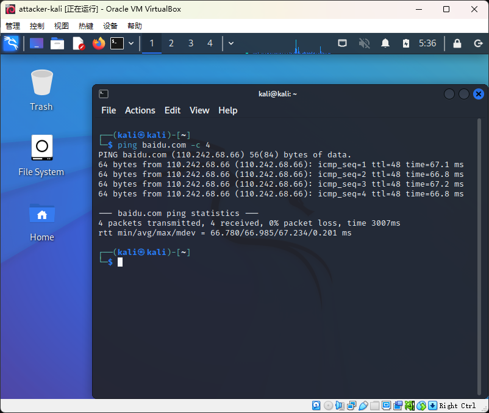
gateway-debian|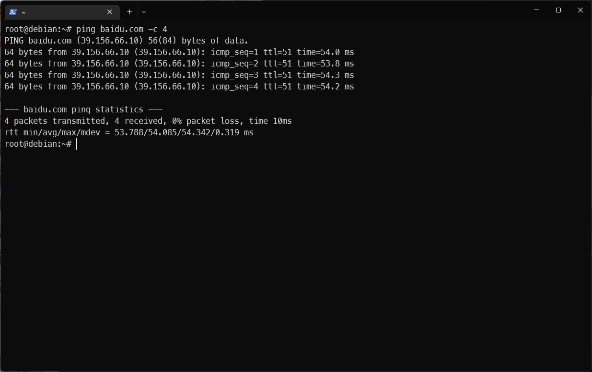

## 总结

### 一点心得

其实写到这里只想要快点结束了，已经写不动了，原本计划各种吐槽的心情结果也在完成这整篇报告的过程中被冲淡了😔

之前课上说的，为了适应当前容器化的开发方式，今年课程的实验最好是能在容器内完成，第一次提交一半的报告那会真的有想去试一下容器，因为很快就完成了这一部分的实验操作，现在来说因为要完成这篇究极长篇的报告，结果也变得没那么有动力了，总之如果后面没有实验的课程期间如果哪天又来了兴趣再去试试看吧

## 参考链接

- [Virtualbox 多重加载 高级功能介绍](https://blog.csdn.net/Jeanphorn/article/details/45056251)

- [Chapter 5. Virtual Storage](https://www.virtualbox.org/manual/ch05.html)

- [Windows XP配置方法](http://ipv6.ustb.edu.cn/config_winxp.html)

- [How to install kernel headers on Debian](https://linuxhint.com/install-kernel-headers-debian/)

- [Chapter 6. Virtual Networking](https://www.virtualbox.org/manual/ch06.html)

- [VirtualBox Network Settings: Complete Guide](https://www.nakivo.com/blog/virtualbox-network-setting-guide/)
