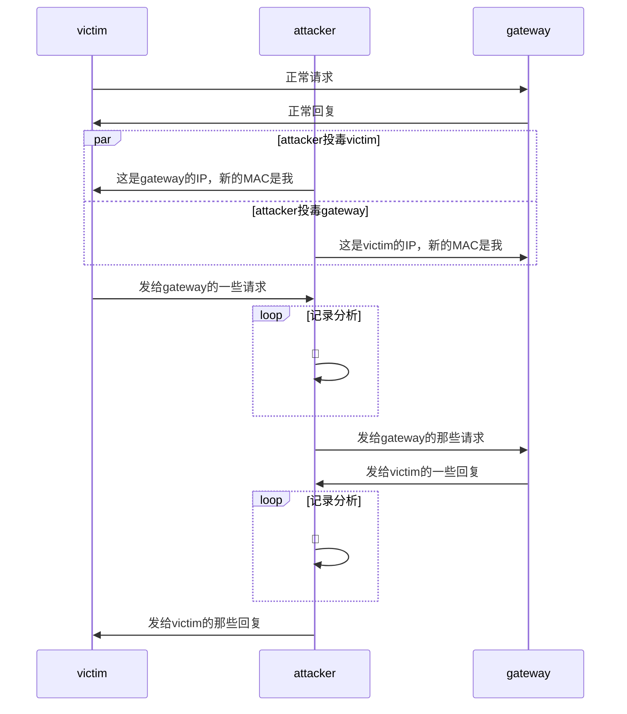
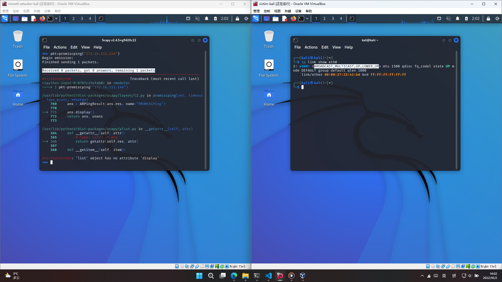
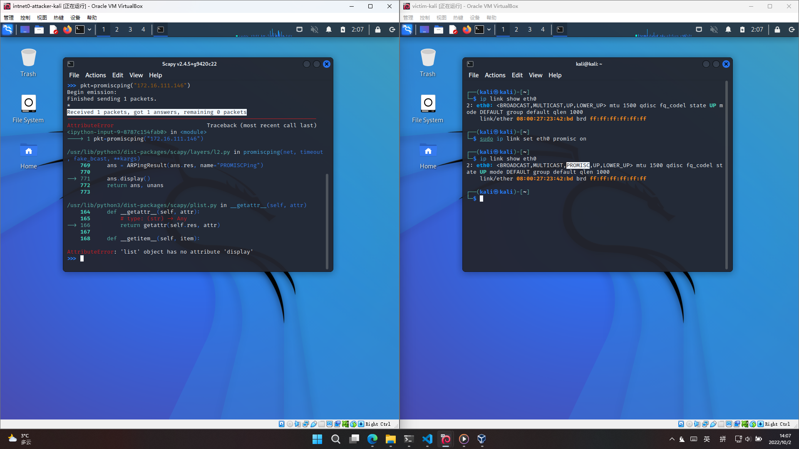

# 网络监听

## 实验环境

### 网络拓扑

理论上应该按照上面👆这个来搭🤔

但是仔细分析了一下实验目标，其实只需要`victim`、`attacker`和`gateway`三个节点即可，并且完全是三点一线，于是将进行适当简化

#### “一图胜千言”

无需多言，下面这张图将直观说明本次实验的拓扑结构，甚至还画出了实验内容的主要操作思路

于是这次为了节省电脑资源，仅使用上一次实验中准备好的`gateway-debian`和`victim-kali`，外加因本次实验特殊需求而临时多重加载出来的`intnet0-attacker-kali`3台虚拟机也就是仍然使用VirtualBox

如此安排是因为之前的`attacker-kali`被安排在了内部网络`intnet0`之外，无论如何我也不想再配置一次网卡了，并且`victim-xp-1`对于网卡混杂模式的配置也不如Linux终端一条指令那么简单

以下是配置信息，主要是3台机器的网卡MAC与实验时分配到的IP信息：

虚拟机|身份|网卡配置
:-:|:-:|:-:
intnet0-attacker-kali|攻击者|
gateway-debian|网关|
victim-kali|受害者|

## 实验要求

- [x] 检测局域网中的异常终端

- [x] 手工单步“毒化”目标主机的ARP缓存

- [x] (可选)使用自动化工具完成ARP投毒劫持实验

- [ ] (可选)基于scapy编写ARP投毒劫持工具

## 实验过程记录

### 检测局域网中的一场终端

首先是scapy的配置，由于是直接使用的kali所以系统直接有预装

按照实验说明的步骤一点点来，依照个人的网络拓扑对说明中示例的操作指令进行针对性修改

这部分的思路是：分别在受害者主机关闭与开启网卡混杂模式的情况下，在攻击者主机用scapy发送promiscping，也就是利用ARP的who-has请求，通过包的接收情况来确定目标网络内开启混杂模式网卡的主机情况

由于实验说明中给出了完整的代码执行流程，这里就直接通过结果截图来说明了：

受害者主机网卡状态|结果截图
:-:|:-:
关闭混杂模式|
开启混杂模式|

### 手工单步“毒化”目标主机的ARP缓存

仍然是同上一部分相似的形式，完全按照说明的流程进行操作，而实现的内容就是前文中的[“一图胜千言”](#一图胜千言)中攻击者的par部分平行操作

### 使用自动化工具完成ARP投毒劫持实验

## 总结

### 各种踩坑

#### 一般Windows用户确实用不上网卡的混杂模式

这里放上还没意识到踩坑时候的报告原文：

>于是这次为了节省电脑资源，仅使用上一次实验中准备好的`victim-xp-1`，`gateway-debian`和`victim-kali`三台虚拟机，也就是仍然使用VirtualBox，其中`victim-kali`为本次的攻击者身份，如此安排是因为之前的`attacker-kali`被安排在了内部网络`intnet0`之外，无论如何我也不想再配置一次网卡了

其实标题就看出来了，Windows不能像Linux一样简单地通过终端命令就开启网卡的混杂模式，回看上面当时的内容记录，我原计划直接使用之前搭好的内部网络`intnet0`中的3台虚拟机，于是出师未捷身先死，直接从拓扑设计改起🤯

### 一点心得

#### 首次在报告内使用Mermaid图表🧜‍

原本觉得GitHub会不支持渲染Mermaid所以一直没有尝试使用，也是在写这篇报告之前心血来潮查了一下，发现已经支持了就尝试学习使用了一下，碰巧本次实验的拓扑结构非常适合用sequenceDiagram来表示，结合上一次报告PR中的Recommends，就有了前面的[“一图胜千言”](#一图胜千言)，希望没有弄巧成拙吧😂

## 参考链接

- [How can I set the NIC to promiscous mode ?](https://knowledge.broadcom.com/external/article/159643/how-can-i-set-the-nic-to-promiscous-mode.html)

- [Permission issue when using scapy](https://python-forum.io/thread-36293.html)

- [Sequence Diagram](https://mermaid-js.github.io/mermaid/#/sequenceDiagram)
