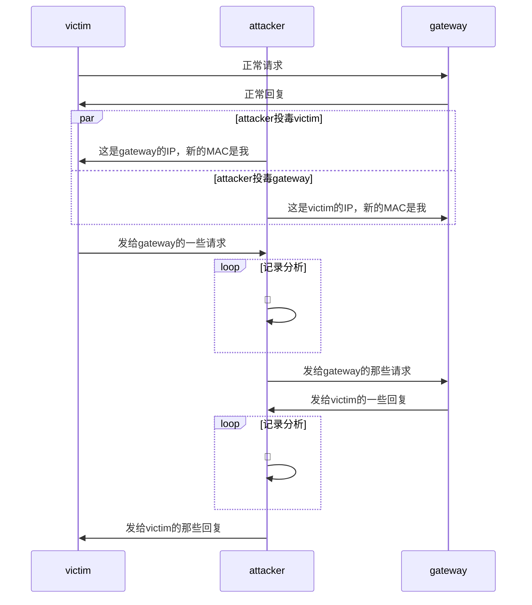

# 网络监听

## 实验环境

### 网络拓扑

理论上应该按照上面👆这个来搭，但是仔细分析了一下实验目标，其实只需要`victim`、`attacker`和`gateway`即可，并且三个节点完全是三点一线：

于是这次为了节省电脑资源，仅使用上一次实验中准备好的`victim-xp-1`，`gateway-debian`和`victim-kali`三台虚拟机，也就是仍然使用VirtualBox，其中`victim-kali`为本次的攻击者身份，如此安排是因为之前的`attacker-kali`被安排在了内部网络`intnet0`之外，无论如何我也不想再配置一次网卡了

以下是配置信息：

虚拟机|身份|网卡配置
:-:|:-:|:-:
victim-kali|攻击者|
gateway-debian|网关|
victim-xp-1|受害者|

## 实验要求

- [x] 检测局域网中的异常终端

- [x] 手工单步“毒化”目标主机的ARP缓存

- [x] (可选)使用自动化工具完成ARP投毒劫持实验

- [ ] (可选)基于scapy编写ARP投毒劫持工具

## 实验过程记录

### 检测局域网中的一场终端

### 手工单步“毒化”目标主机的ARP缓存

### 使用自动化工具完成ARP投毒劫持实验

## 总结

### 各种踩坑

#### 一般Windows用户确实用不上网卡的混杂模式

这里放上还没意识到踩坑时候的报告原文：

>于是这次为了节省电脑资源，仅使用上一次实验中准备好的`victim-xp-1`，`gateway-debian`和`victim-kali`三台虚拟机，也就是仍然使用VirtualBox，其中`victim-kali`为本次的攻击者身份，如此安排是因为之前的`attacker-kali`被安排在了内部网络`intnet0`之外，无论如何我也不想再配置一次网卡了

其实标题就看出来了，Windows不能像Linux一样简单地通过终端命令就开启网卡的混杂模式，回看上面当时的内容记录，我原计划直接使用之前搭好的内部网络`intnet0`中的3台虚拟机，于是出师未捷身先死，直接从拓扑设计改起🤯

### 一点心得

## 参考链接

- [How can I set the NIC to promiscous mode ?](https://knowledge.broadcom.com/external/article/159643/how-can-i-set-the-nic-to-promiscous-mode.html)
