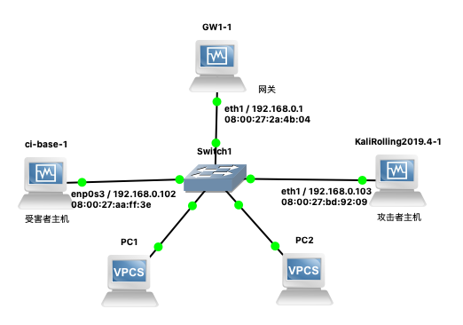

# 网络监听

## 实验环境

### 网络拓扑



理论上应该按照上面👆这个来搭🤔

但是仔细分析了一下实验目标，其实只需要`victim`、`attacker`和`gateway`三个节点即可，并且完全是三点一线，于是将进行适当简化

#### “一图胜千言”

无需多言，下面这张图将直观说明本次实验的拓扑结构，甚至还画出了实验内容的主要操作思路


于是这次为了节省电脑资源，仅使用上一次实验中准备好的`gateway-debian`和`victim-kali`，外加因本次实验特殊需求而临时多重加载出来的`intnet0-attacker-kali`3台虚拟机也就是仍然使用VirtualBox

如此安排是因为之前的`attacker-kali`被安排在了内部网络`intnet0`之外，无论如何我也不想再配置一次网卡了，并且`victim-xp-1`对于网卡混杂模式的配置也不如Linux终端一条指令那么简单

以下是配置信息，主要是3台机器的网卡MAC与实验时分配到的IP信息：

虚拟机|身份|网卡配置
:-:|:-:|:-:
intnet0-attacker-kali|攻击者|
gateway-debian|网关|
victim-kali|受害者|

## 实验要求

- [x] 检测局域网中的异常终端

- [x] 手工单步“毒化”目标主机的ARP缓存

- [x] (可选)使用自动化工具完成ARP投毒劫持实验

- [ ] (可选)基于scapy编写ARP投毒劫持工具

## 实验过程记录

### 检测局域网中的一场终端

首先是scapy的配置，由于是直接使用的kali所以系统直接有预装

按照实验说明的步骤一点点来，依照个人的网络拓扑对说明中示例的操作指令进行针对性修改

这部分的思路是：分别在受害者主机关闭与开启网卡混杂模式的情况下，在攻击者主机用scapy发送promiscping，也就是利用ARP的who-has请求，通过包的接收情况来确定目标网络内开启混杂模式网卡的主机情况

由于实验说明中给出了完整的代码执行流程，这里就直接通过结果截图来说明了：

受害者主机网卡状态|结果截图
:-:|:-:
关闭混杂模式|
开启混杂模式|

### 手工单步“毒化”目标主机的ARP缓存

仍然是同上一部分相似的形式，完全按照说明的流程进行操作，而实现的内容就是前文中的[“一图胜千言”](#一图胜千言)中攻击者的par部分平行操作

操作|结果截图
:-:|:-:
攻击者获取网关MAC地址|
攻击者伪造网关的ARP响应并检查受害者主机ARP缓存污染情况|

这里放上ARP投毒部分截图中迷惑操作的[简单思路说明](#对手工单步毒化目标主机的arp缓存发起的虚假教程投诉)

最后一步通过ping命令重新借正确的ARP包获取网关MAC地址以恢复污染操作这里省略，实在没有什么技术含量(其实就是懒得截图🤫)

### 使用自动化工具完成ARP投毒劫持实验

咕咕噜了`kali arpspoof`，得到了kali官方对`dsniff`的文档说明，这个包内包括一个工具就是`arpspoof`，于是决定直接使用这个(直球)

首先需要在系统中安装`dsniff`包，不做过多说明了，安装完成后直接使用`arpspoof`会弹出无意义的提示：

```bash
arpspoof: libnet_open_link(): UID/EUID 0 or capability CAP_NET_RAW required
```

有了前面scapy的经验，我直接使用`sudo -E arpspoof`，不出意外一切正常，得到如下回显：

```bash
Version: 2.4
Usage: arpspoof [-i interface] [-c own|host|both] [-t target] [-r] host
```

直接看其实并不能看懂，查了一下man手册，结果还发现了手册里面丢字母了😂


读完之后加上一点思考得知`-i`用来指定使用的网卡；`-c`应该是cleaning的意思，用来恢复劫持的地址的，由于能够使用虚拟硬件地址所以可以有自身、目标主机和两者同时的选择；`-t`指定ARP投毒主机，不指定直接局域网内全部主机😰，可以重复指定单个目标；`-r`直接进行双向投毒，一步完成对网关和投毒主机的劫持；`host`用来指定劫持数据包的主机，通常指代本地网关

总之非常疑惑的解释，有点解释了但是没完全解释的感觉，姑且使用如下操作来测试：

```bash
#指定了网卡使用eth0
#目标投毒主机地址输入victim-kali的IP地址
#使用-r启用双向劫持
#劫持主机地址是gateway-debian中负责intnet0网卡的IP地址
sudo -E arpspoof -i eth0 -t "172.16.111.146" -r "172.16.111.1"
```

以下是执行效果截图：

身份|效果截图
:-:|:-:
受害者主机|
网关|

左侧攻击者主机会一直发送ARP响应包，处于刷屏状态，效果上来看是成功了没问题呢，关键是这个工具在`Ctrl+C`之后还会贴心地帮你自动清理污染的ARP缓存，也就是用正确的MAC地址重新向污染的主机发送，等待攻击者主机这边的`arpspoof`进程退出后，回到网关和受害者主机再次检查ARP缓存可见均已恢复正常

## 总结

### 各种踩坑

#### 一般Windows用户确实用不上网卡的混杂模式

这里放上还没意识到踩坑时候的报告原文：

>于是这次为了节省电脑资源，仅使用上一次实验中准备好的`victim-xp-1`，`gateway-debian`和`victim-kali`三台虚拟机，也就是仍然使用VirtualBox，其中`victim-kali`为本次的攻击者身份，如此安排是因为之前的`attacker-kali`被安排在了内部网络`intnet0`之外，无论如何我也不想再配置一次网卡了

其实标题就看出来了，Windows不能像Linux一样简单地通过终端命令就开启网卡的混杂模式，回看上面当时的内容记录，我原计划直接使用之前搭好的内部网络`intnet0`中的3台虚拟机，于是出师未捷身先死，直接从拓扑设计改起🤯

#### scapy权限不足的相关处理

详细的报错情况下图所示👇


其实也没有很关心具体哪里有问题，只关注了报错分类：

```python
PermissionError: [Errno 1] Operation not permitted
```

合理使用咕咕噜搜索`scapy permission error`，第一条结果告诉我要使用

```bash
sudo -E scapy
```

出于对自己负责的心理，用`sudo -h`了解了一下`sudo -E`的含义，以下是部分输出原文：

>Options:  
>-E, --preserve-env  
>preserve user environment when running commend

(由于Markdown渲染不支持空格缩进，做了换行处理)

于是得知`-E`的作用是提权运行指令但是保留原本的用户环境，不过我倒是怀疑kali是不是本来就配置scapy为`sudo pip install scapy`什么的🤔

另外找到`sudo -E scapy`解决方案的那篇帖子下面其实刚好有说到关于如果使用`sudo pip install scapy`是否还会出现类似问题，答主则仍是给出“`sudo -E scapy`就足够解决问题”的回复，但是说到了scapy是直接通过操作系统访问raw socket(每日一个看得懂但是不知道怎么用中文说的东西)，所以sudo/root访问是必须的

总之得知`sudo -E`功能能处理很多权限问题并且能保留原本的用户权限这点就很有收获了😊

#### 对“手工单步‘毒化’目标主机的ARP缓存”发起的虚假教程投诉

首先我不好说是不是由于时间原因，原本可以达成的操作现在不可以达成了，还是说只想着顺着实验说明(照抄实验说明)操作又让黄药师摆了一道😶

问题出在实验说明中在`伪造网关的ARP响应包`部分，在构造投毒包的时候只给写到了ARP协议，也就是网络层封包，但是没有给以太网协议封包，也就是数据链路层(明明实验一里面还写了来着，看来刻意坑人嫌疑很大🤔)

是的，没有数据链路层封包，你为什么期待网络层的ARP包能飞到受害者主机呢？

然后没有然后了，意识到发包半天没有效果(是的我居然真的发了好几遍但是检查受害者主机那里网关的MAC就是纹丝不动🤯)之后飞速用实验一的方式构造`带有以太网协议封包的`ARP who-has tell包获得了受害者主机的MAC地址，然后立刻给投毒用ARP包套了一层以太网协议然后就发送了，导致甚至没有之前的踩坑截图(逃)

总之解决了，正文里面还有操作的截图，还是一句话，小心驶得万年船🤦‍

### 一点心得

#### 首次在报告内使用Mermaid图表🧜‍

原本觉得GitHub会不支持渲染Mermaid所以一直没有尝试使用，也是在写这篇报告之前心血来潮查了一下，发现已经支持了就尝试学习使用了一下，碰巧本次实验的拓扑结构非常适合用sequenceDiagram来表示，结合上一次报告PR中的Recommends，就有了前面的[“一图胜千言”](#一图胜千言)，希望没有弄巧成拙吧😂

## 参考链接

- [Sequence Diagram](https://mermaid-js.github.io/mermaid/#/sequenceDiagram)

- [How can I set the NIC to promiscous mode ?](https://knowledge.broadcom.com/external/article/159643/how-can-i-set-the-nic-to-promiscous-mode.html)

- [Permission issue when using scapy](https://python-forum.io/thread-36293.html)

- [dsniff | Kali Linux Tools](https://www.kali.org/tools/dsniff/)
