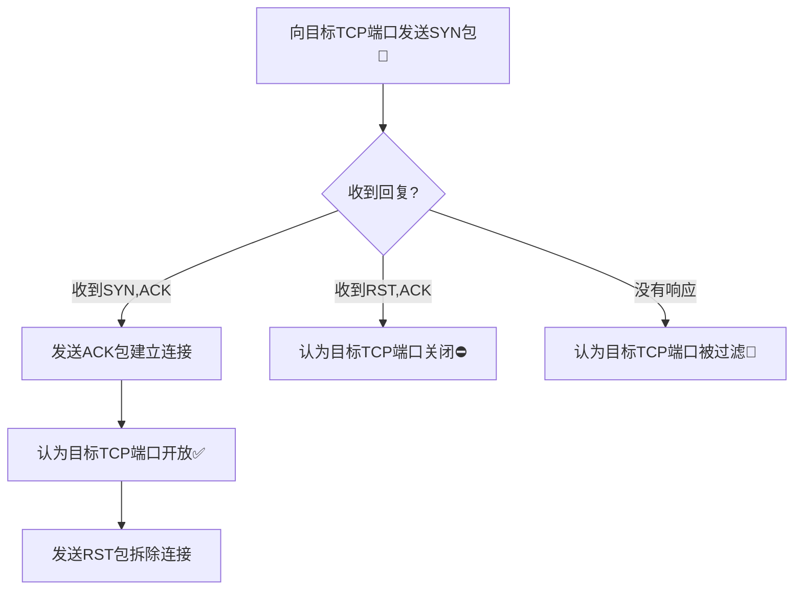
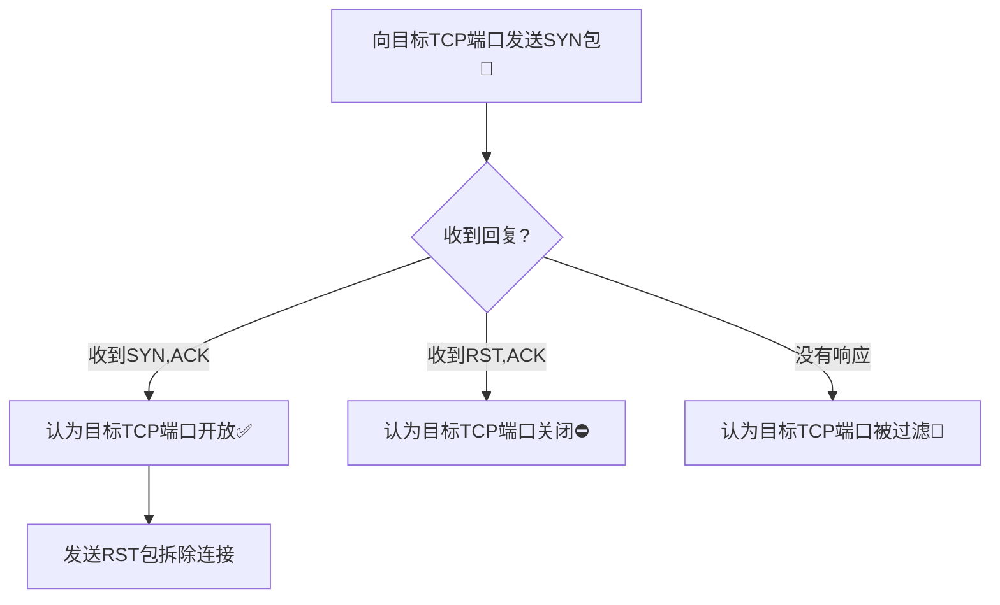

# 基于Scapy编写端口扫描器

## 实验要求

- [x] 禁止探测互联网上的IP，严格遵守网络安全相关法律法规

- 完成以下扫描技术的编程实现

  - [ ] TCP connect scan / TCP stealth scan

  - [ ] TCP Xmas scan / TCP fin scan / TCP null scan

  - [ ] UDP scan

- [ ] 上述每种扫描技术的实现测试均需要测试端口为：`开放`、`关闭`和`过滤`状态时的程序执行结果

- [ ] 提供每一次扫描测试的抓包结果并分析与课本中的扫描方法原理是否相符？如果不同，试分析原因

- [ ] 在实验报告中详细说明实验网络环境拓扑、被测试IP的端口状态时如何模拟的

- [ ] (可选) 复刻`nmap`的上述扫描技术实现的命令行参数开关

## 实验环境

## 实验记录

### 代码编写部分

这一部分没有打算写太多内容，主要是说清楚代码的思路

另外是代码的可读性很高，这点我充满自信( •̀ ω •́ )✧

#### TCP Connect扫描

由于是先写的TCP SYN扫描，结果回过头写这个的时候发现大部分就是直接复制粘贴SYN扫描的代码😂

以下是代码设计思路：



有没有觉得和下面SYN扫描的设计图有亿点点相似😏

#### TCP Stealth扫描

首先这个命名很具有迷惑性，咕咕噜了一下得知其实是TCP SYN扫描，只是比TCP Connect扫描少了收到SYN,ACK后返回ACK而已，只是不建立连接，也不知道为什么就“stealth”了🤔

代码内容这里不赘述，稍微画一下设计思路：



#### TCP Xmas扫描

#### TCP FIN扫描

#### TCP NULL扫描

#### UDP扫描

### 代码测试部分

## 实验总结

### 各种踩坑

#### 论提前了解黑话的重要性

可以看到参考链接里面有放上我搜索TCP的flags简写并“采纳”的回答（这么说感觉自己好狂😂），是的，上来看Scapy的文档，甚至看不明白RA的意思，看到SA猜测了一下是SYN,ACK的缩写，但是疑惑RA是不是RST,ACK的缩写，咕咕噜一下`tcp ra flag`很快找到了很详尽的解释，用得上的简写用表格记录一下吧：

flag简写|含义
:-:|:-:
TCP:RA|RST,ACK
TCP:FA|FIN,ACK
TCP:SA|SYN,ACK

#### 或许`iptables`应该优先于本次实验学习

当然，需要先了解攻击，然后才会有防御的相关考量，这一点之前课上有说过，所以才说“或许”，但是只是针对这次实验来说，如果没有`iptables`的相关知识，首先就不能创造出drop包的filtered端口环境，于是也不能很好地得知扫描filtered的端口时在包被drop没有回应的情况下scapy的`sr()`函数会如何return，这种情况下又怎么编写工具呢，判断逻辑这块就已经断了😔

又或者这次实验就是为了以这种旁敲侧击的方式让人学习也说不定🤔总之是先去学习了drop一些常见端口扫描的`iptables`规则，才能进一步研究扫描工具的判定逻辑

当然也可以研究Windows的防火墙就是了，但是没有选这条路

另外是放上学习`iptables`的记录，是之前老师配好的Debian10系统中的`iptables`的开机自启规则文件`/etc/network/interfaces`的一些阅读理解注释，话说为了找到这个文件也算是费了不少功夫（这里就不说了）：

```bash
# This file describes the network interfaces available on your system
# and how to activate them. For more information, see interfaces(5).

source /etc/network/interfaces.d/*

# The loopback network interface
auto lo
iface lo inet loopback

# The primary network interface
allow-hotplug enp0s3
iface enp0s3 inet dhcp
allow-hotplug enp0s8
iface enp0s8 inet dhcp
allow-hotplug enp0s9
iface enp0s9 inet static
  address 172.16.111.1
  netmask 255.255.255.0
  post-up echo 1 > /proc/sys/net/ipv4/ip_forward
  post-up   iptables -P FORWARD DROP #将FORWARD链规则设置为DROP（先设置为丢弃所有包，随后再一条条添加白名单规则的意思吧）
  post-up   iptables -t nat -A POSTROUTING -s '172.16.111.0/24' ! -d '172.16.111.0/24' -o enp0s3 -j MASQUERADE #选择nat表，向POSTROUTING链追加：出口为enp0s3的源网段“172.16.111.0/24”到目的网段非“172.16.111.0/24”的流量，规则为MASQUERADE（查了一下这个MASQUERADE规则，个人觉得的好理解的说法就是构建NAT网络，从出口无法得知入口的网络信息，实现了字面意义上的“Masquerade”，这一条规则的意思大致是172.16.111.0/24网段通过enp0s3访问外部网络要使用NAT逻辑，应该没理解错吧）
  post-up   iptables -I FORWARD -s '172.16.111.0/24' ! -d '172.16.111.0/24' -i enp0s9 -j ACCEPT #向FORWARD链插入：入口为enp0s9的源网段“172.16.111.0/24”到目的网段非“172.16.111.0/24”的流量，规则为ACCEPT（说人话就是允许入口为enp0s9的172.16.111.0/24网段内的主机互相访问）
  post-up   iptables -I FORWARD -s '172.16.111.0/24' -d '172.16.222.0/24' -i enp0s9 -j DROP #向FORWARD链插入：入口为enp0s9的源网段“172.16.111.0/24”到目的网段“172.16.222.0/24”的流量，规则为DROP（说人话就是阻止入口为enp0s9的172.16.111.0/24网段内的主机访问172.16.222.0/24网段）
  post-up   iptables -A FORWARD -m state --state RELATED,ESTABLISHED -j ACCEPT #向FORWARD链追加：匹配state模块中满足RELATED和ESTABLISHED状态的流量，规则为ACCEPT（最开始不是很理解这块，逐一分析就清楚了，首先是ESTABLISHED为防火墙允许且有跟踪的连接状态，RELATED为已经判定为由ESTABLISHED状态的连接生成的主连接之外的连接（好绕救命🤮），翻译过来的话就是防火墙允许的连接和其“子连接”都被允许通过）
  post-down iptables -t nat -D POSTROUTING -s '172.16.111.0/24' ! -d '172.16.111.0/24' -o enp0s3 -j ACCEPT #这里显然是ifdown时进行的操作，删掉之前追加的规则，不详细再写一遍了
  post-down iptables -D FORWARD -s '172.16.111.0/24' ! -d '172.16.111.0/24' -i enp0s9 -j ACCEPT #同样是删除操作
  post-down iptables -D FORWARD -m state --state RELATED,ESTABLISHED -j ACCEPT #仍然是删除操作
  post-down iptables -I FORWARD -s '172.16.111.0/24' -d '172.16.222.0/24' -i enp0s9 -j DROP #这里很有趣，到最后ifdown了仍然要插入阻止172.16.111.0/24内网访问到172.16.222.0/24网段的DROP规则，属于明确划分界限了😂
allow-hotplug enp0s10
iface enp0s10 inet static #下面的enp0s10网卡配置和上面的enp0s9几乎照抄，不赘述了
  address 172.16.222.1
  netmask 255.255.255.0
  post-up   iptables -P FORWARD DROP
  post-up   iptables -t nat -A POSTROUTING -s '172.16.222.0/24' ! -d '172.16.222.0/24' -o enp0s3 -j MASQUERADE
  post-up   iptables -I FORWARD -s '172.16.222.0/24' ! -d '172.16.222.0/24' -i enp0s10 -j ACCEPT
  post-up   iptables -I FORWARD -s '172.16.222.0/24' -d '172.16.111.0/24' -i enp0s10 -j DROP
  post-down iptables -t nat -D POSTROUTING -s '172.16.222.0/24' ! -d '172.16.222.0/24' -o enp0s3 -j MASQUERADE
  post-down iptables -D FORWARD -s '172.16.222.0/24' ! -d '172.16.222.0/24' -i enp0s10 -j ACCEPT
  post-down iptables -I FORWARD -s '172.16.222.0/24' -d '172.16.111.0/24' -i enp0s10 -j DROP
```

另外觉得必须说说`iptables`中有关--tcp-flags的解读，这里放上让我搞明白--tcp-flags工作原理的解释原文：

>[!] --tcp-flags mask comp  
>Match  when  the TCP flags are as specified.  The first argument mask is the flags which we should examine, written as a comma-separated list, and the second argument comp is a comma-separated list of flags which must be set.  Flags are: SYN ACK FIN RST URG PSH ALL NONE.  Hence the command iptables -A FORWARD -p tcp --tcp-flags SYN,ACK,FIN,RST SYN will only match packets with the SYN flag set, and the ACK, FIN and RST flags unset.

简单翻译一下，其中的核心在于，mask指明了对TCP包的哪些flags进行检测，当出现comp中列出的flags时认为匹配到规则，于是执行规则的DROP

这时再去写特定的TCP过滤规则感觉会清爽很多了😃

再次感慨：或许`iptables`应该优先于本次实验学习🤔

### 一点心得

## 参考链接

- [Usage — Scapy 2.5.0 documentation](https://scapy.readthedocs.io/en/latest/usage.html)

- [networking - What do the following mean: TCP:RA, TCP:FA ,TCP:PA, TCP:S, TCP:SEC - Server Fault](https://serverfault.com/questions/1008268/what-do-the-following-mean-tcpra-tcpfa-tcppa-tcps-tcpsec)

- [TCP SYN (Stealth) Scan (-sS) | Nmap Network Scanning](https://nmap.org/book/synscan.html)

- [Block Well-Known TCP Attacks](https://serverfault.com/questions/245711/iptables-tips-tricks/245713#245713)

- [linux - What is MASQUERADE made for? - Super User](https://superuser.com/questions/935969/what-is-masquerade-made-for)

- [Iptables State Module - NovaOrdis Knowledge Base](https://kb.novaordis.com/index.php/Iptables_State_Module)

- [explainshell.com - iptables -A INPUT -p tcp --tcp-flags SYN,RST,ACK,FIN SYN -j ACCEPT # äquivalent zu: --syn](https://explainshell.com/explain?cmd=iptables+-A+INPUT+-p+tcp+--tcp-flags+SYN%2CRST%2CACK%2CFIN+SYN+-j+ACCEPT++%23+%C3%A4quivalent+zu%3A+--syn#)

- [Port scanning using Scapy | Infosec Resources](https://resources.infosecinstitute.com/topic/port-scanning-using-scapy/)

- [hashtaginfosec/portScan: Simple port scan scripts written in Python,](https://github.com/hashtaginfosec/portScan)
